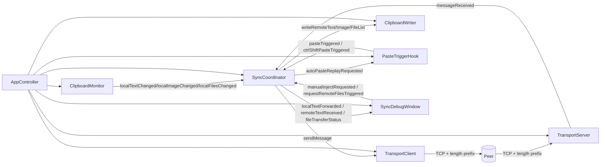

# Multi-platform Clipboard Sync 项目类职责与关系梳理

本文档用于快速理解当前 MVP 中各个核心类的职责边界，以及它们之间的协作关系。

## 1. 总体分层

- 入口与装配层
  - `main.cpp`：创建 Qt 应用并启动 `AppController`。
  - `AppController`：集中创建组件、绑定信号槽、启动服务。
- 采集与写入层
  - `ClipboardMonitor`：监听本地剪贴板变化并发出规范化事件。
  - `ClipboardWriter`：将远端内容写入本地剪贴板，并做防回环控制。
- 协调层
  - `SyncCoordinator`：系统核心，负责本地事件外发、远端消息落地、文件下载状态机。
- 传输层
  - `TransportClient`：对端连接与消息发送。
  - `TransportServer`：本地监听与入站消息解析。
- 协议层
  - `protocol::ClipboardMessage`、`protocol::MessageType`：消息模型。
  - `MessageCodec`：协议编码/解码与校验。
- 输入触发层
  - `PasteTriggerHook`：监听 Ctrl+V / Ctrl+Shift+V，触发文件拉取与粘贴拦截。
- UI 调试层
  - `SyncDebugWindow`：展示同步日志，提供手动注入与手动请求入口。
- 通用配置层
  - `AppConfig`：环境变量配置读取。
  - `setupLogging()`：统一日志格式。

## 2. 各类职责明细

### 2.1 AppController

职责：
- 读取配置并初始化全局日志。
- 创建核心对象（监控器、写入器、客户端、服务端、协调器、粘贴钩子、调试窗口）。
- 绑定主要信号槽关系。
- 启动服务监听、客户端重连循环与粘贴触发监听。

特点：
- 属于组合根（Composition Root），不承载业务协议细节。

### 2.2 ClipboardMonitor

职责：
- 监听 `QClipboard::dataChanged`。
- 分别识别文本、图片、文件列表三类剪贴板内容。
- 对内容做规范化与哈希，发出：
  - `localTextChanged(text, hash)`
  - `localImageChanged(pngBytes, hash)`
  - `localFilesChanged(paths, hash)`

特点：
- 内置读取重试预算（解决某些应用延迟提供剪贴板数据的问题）。
- 图片统一转成 PNG 字节，方便跨端传输。

### 2.3 ClipboardWriter

职责：
- 将远端文本/图片/文件列表写回本地系统剪贴板。
- 维护近期注入哈希（TTL 窗口）用于抑制“本地监听 -> 再次发送”的回环。
- 提供 `isRecentlyInjected*` 查询给协调器使用。

特点：
- 写入失败自动重试。
- 对文本换行、图片内容、文件列表做稳定哈希。
- 写入前暂存哈希，失败时回滚，避免污染状态。

### 2.4 SyncCoordinator

职责：
- 本地->远端：接收 `ClipboardMonitor` 事件，通过 `TransportClient` 发送协议消息。
- 远端->本地：接收 `TransportServer` 消息，调用 `ClipboardWriter` 落地。
- 文件同步：
  - 发送端发布 `FileOffer`（元数据 + SHA256）。
  - 接收端按窗口发 `FileRequest`。
  - 发送端回 `FileChunk`（含 offset/CRC）与 `FileComplete`。
  - 接收端校验并写入临时目录，最终把下载文件列表写入本地剪贴板。
- 粘贴联动：支持普通 Ctrl+V 触发拉取、Ctrl+Shift+V 手动拉取、下载完成后自动补发 Ctrl+V。

特点：
- 是项目业务中枢与状态机核心。
- 管理文件下载窗口、超时、重试、断线暂停与重连续传。

### 2.5 TransportClient

职责：
- 维护到对端的 TCP 连接。
- 周期重连。
- 将 `MessageCodec::encode` 的包按“4 字节长度前缀 + 包体”发送。

特点：
- 发送缓冲有上限，防止内存无限增长。
- 通过 `peerConnected/peerDisconnected` 通知协调器进行续传控制。

### 2.6 TransportServer

职责：
- 监听端口接受入站连接。
- 维护每个 socket 的接收缓冲。
- 按长度前缀拆帧，解码为 `protocol::ClipboardMessage` 并发出 `messageReceived`。

特点：
- 粘包/半包场景通过缓冲累积处理。
- 无效包直接丢弃并记录告警。

### 2.7 MessageCodec 与 ProtocolHeader

职责：
- `ProtocolHeader.h`：定义协议常量、消息类型枚举、消息结构。
- `MessageCodec`：负责包级编码/解码、魔数与版本校验、长度一致性校验、负载校验和校验。

特点：
- 协议采用小端序。
- 头部固定长度 + payload，便于跨语言实现。

### 2.8 PasteTriggerHook

职责：
- 监听粘贴触发：
  - `pasteTriggered`（Ctrl+V）
  - `ctrlShiftPasteTriggered`（Ctrl+Shift+V）
- 根据协调器提供的决策函数决定是否拦截 Ctrl+V。
- 下载完成后可“补发一次 Ctrl+V”。

特点：
- Windows 走全局低级键盘钩子。
- Linux（X11）可走全局检测线程；若能力不足退化为应用级事件过滤。
- 具备防抖与 synthetic paste 忽略窗口，避免自触发循环。

### 2.9 SyncDebugWindow

职责：
- 展示本地外发与远端接收日志。
- 提供两个调试入口：
  - 手动写本地并发送文本。
  - 模拟粘贴触发远端文件拉取。

特点：
- 纯调试辅助，不参与协议与传输核心逻辑。

### 2.10 AppConfig / Logger

职责：
- `AppConfig::fromEnvironment()`：读取 `CSYNC_*` 环境变量并给出默认值。
- `setupLogging()`：设置统一日志输出模板。

## 3. 核心关系图

## 4. 关键时序

### 4.1 文本/图片同步（常规链路）

1. 本地复制后，`ClipboardMonitor` 产生变更事件。
2. `SyncCoordinator` 先用 `ClipboardWriter::isRecentlyInjected*` 过滤回环。
3. 若非回环，`SyncCoordinator` 组装消息并通过 `TransportClient` 发送。
4. 对端 `TransportServer` 收包并解码后回调对端 `SyncCoordinator`。
5. 对端 `SyncCoordinator` 调用 `ClipboardWriter` 写入本地剪贴板。
6. 写入产生的本地变化会被防回环哈希窗口抑制，不会再反向发送。

### 4.2 文件同步（Offer + Request + Chunk）

1. 发送端本地复制文件列表，`SyncCoordinator` 发送 `FileOffer`（元信息+SHA256）。
2. 接收端收到 Offer 后缓存为“待拉取会话”。
3. 触发方式：
   - Windows/X11 下用户 Ctrl+V（可拦截原始粘贴并转为先拉取）。
   - Ctrl+Shift+V 强制拉取。
   - 某些非全局钩子平台收到 Offer 后自动拉取。
4. 接收端按窗口发 `FileRequest(offset,length,requestId)`。
5. 发送端回传多个 `FileChunk`（带 offset 与 CRC32），末尾发 `FileComplete`。
6. 接收端顺序校验、CRC 校验、落盘并增量 SHA256 校验。
7. 整个会话完成后，把下载到的本地路径列表写入剪贴板，可选择自动补发 Ctrl+V。

## 5. 设计边界与扩展建议

- 当前 `SyncCoordinator` 责任较重：包含文本/图片路由、文件传输状态机、粘贴联动策略。
  - 后续可拆分为 `ClipboardSyncService` 与 `FileTransferService` 两个子协调器。
- 协议层已预留 `Ack/Nack/Error` 与流式类型，尚可继续增强可靠传输能力。
- UI 目前是调试视图；若演进正式产品，建议将 UI 与业务信号契约进一步稳定化。

## 6. 快速定位（按文件）

- 组装入口：`src/main.cpp`、`src/app/AppController.h/.cpp`
- 剪贴板监听与写入：`src/clipboard/ClipboardMonitor.*`、`src/clipboard/ClipboardWriter.*`
- 同步核心：`src/sync/SyncCoordinator.*`
- 传输层：`src/transport/TransportClient.*`、`src/transport/TransportServer.*`
- 协议层：`src/protocol/ProtocolHeader.h`、`src/protocol/MessageCodec.*`
- 粘贴触发：`src/input/PasteTriggerHook.*`
- 调试窗口：`src/ui/SyncDebugWindow.*`
- 配置与日志：`src/common/Config.*`、`src/common/Logger.*`
