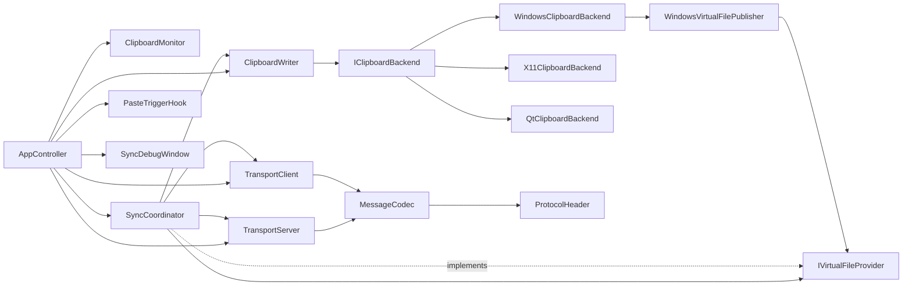

# 项目结构、类关系与剪贴板流程详解

## 1. 先看整体：这个项目在做什么

这个项目是一个基于 Qt 的跨端剪贴板同步系统，核心目标是：

- 本地复制内容（文本/图片/文件）后，转发到对端。
- 对端收到后写入本机剪贴板。
- 文件走流式传输，避免一次性发送大文件。
- 通过防回环机制避免 A->B->A 无限反弹。

可以把它理解为 4 层：

1. 采集层：从本地系统剪贴板读取内容（Monitor）。
2. 编排层：决定如何发送、接收、落盘、重试（SyncCoordinator）。
3. 传输层：协议编码 + TCP 帧传输（MessageCodec + Transport）。
4. 发布层：把远端内容写回本机剪贴板（Writer + Backend）。

---

## 2. 目录与模块职责

### 2.1 启动与装配

- `src/main.cpp`
  - Qt 应用入口，创建 `AppController`。

- `src/app/AppController.h/.cpp`
  - 负责组装所有核心对象：
    - `ClipboardMonitor`
    - `ClipboardWriter`
    - `TransportServer`
    - `TransportClient`
    - `SyncCoordinator`
    - `PasteTriggerHook`
    - `SyncDebugWindow`
  - 连接信号槽，启动 server/client/hook。

### 2.2 剪贴板领域模型与采集/写回

- `src/clipboard/ClipboardSnapshot.h/.cpp`
  - 定义统一数据模型 `Snapshot`：
    - `text` / `html` / `imagePng` / `localFilePaths` / `files`
  - 提供哈希、指纹、JSON 编解码。
  - 作用：把“剪贴板一次变化”抽象成统一对象，减少分支散落。

- `src/clipboard/ClipboardMonitor.h/.cpp`
  - 监听系统剪贴板变化。
  - 读取 `QMimeData`，构造 `Snapshot` 并发出：
    - `localSnapshotChanged`
    - 兼容信号：`localTextChanged/localImageChanged/localFilesChanged`

- `src/clipboard/ClipboardWriter.h`
- `src/clipboard/ClipboardWriterBackend.cpp`
  - 对外提供 `writeRemoteSnapshot`/`writeRemoteText`/`writeRemoteImage`/`writeRemoteFileList`。
  - 内部带重试与防回环哈希 TTL。
  - 根据平台选择 backend（Windows/X11/Qt fallback）。

### 2.3 平台 Backend 抽象

- `src/clipboard/IClipboardBackend.h`
  - 抽象平台写入接口：
    - `writeSnapshot`
    - `readCurrentSnapshot`
    - `supportsNativeVirtualFiles`

- `src/clipboard/QtClipboardBackend.*`
  - 通用 Qt 方式。

- `src/clipboard/WindowsClipboardBackend.*`
  - Windows 下优先尝试 native virtual files。

- `src/clipboard/X11ClipboardBackend.*`
  - X11 下发布文本/图片/uri-list。
  - 当前 `supportsNativeVirtualFiles() == false`。

### 2.4 虚拟文件提供者能力

- `src/clipboard/IVirtualFileProvider.h`
  - 按 `sessionId/fileId/offset/length` 提供文件数据。
  - 是把“协议里的文件流”对接到“系统剪贴板虚拟文件”能力的关键接口。

- `src/clipboard/WindowsVirtualFilePublisher.*`
  - Windows 原生实现：`IDataObject + CFSTR_FILEDESCRIPTORW + CFSTR_FILECONTENTS + IStream`。

### 2.5 同步编排核心

- `src/sync/SyncCoordinator.h/.cpp`
  - 全项目状态机核心。
  - 职责：
    - 收本地变化 -> 发送远端。
    - 收远端消息 -> 落本地剪贴板。
    - 文件 Offer 缓存、下载窗口推进、CRC/SHA 校验。
    - 断线暂停/重连续传。
  - 同时实现 `IVirtualFileProvider`，供 backend 按需读文件。

### 2.6 协议与传输

- `src/protocol/ProtocolHeader.h`
  - 定义消息类型（TextPlain/ImageBitmap/ClipboardSnapshot/FileOffer/FileRequest/FileChunk...）。

- `src/protocol/MessageCodec.h/.cpp`
  - 消息编码解码、头部校验、payload checksum。

- `src/transport/TransportClient.h/.cpp`
  - 出站连接、发送缓冲、重连。

- `src/transport/TransportServer.h/.cpp`
  - 入站监听、分帧、解码、发出 `messageReceived`。

### 2.7 输入触发与调试 UI

- `src/input/PasteTriggerHook.*`
  - 检测粘贴触发（应用内 + Windows 全局 + X11 条件能力）。
  - 支持自动补发 Ctrl+V。

- `src/ui/SyncDebugWindow.*`
  - 调试窗口，展示本地/远端日志。
  - 可手动触发发送和“模拟粘贴触发远端文件拉取”。

---

## 3. 类与类之间的关系

## 3.1 依赖关系（静态）

## 3.2 运行时事件关系（动态）

1. `ClipboardMonitor` 发出本地变化。
2. `SyncCoordinator` 决定如何发给对端。
3. `TransportClient` 发送，远端 `TransportServer` 收到并交给远端 `SyncCoordinator`。
4. 远端 `SyncCoordinator` 调 `ClipboardWriter` 写入本机剪贴板。
5. `ClipboardWriter` 通过平台 backend 真正落到系统剪贴板。

---

## 4. 启动流程（程序一启动发生什么）

1. `main()` 创建 `AppController`。
2. `AppController::initialize()` 读取配置并创建组件。
3. 连接关键信号槽：
   - monitor -> coordinator
   - coordinator -> debug window
   - hook -> coordinator
4. `coordinator.bindServer(server)` 绑定入站消息处理。
5. 启动 `TransportServer` 监听端口。
6. 启动 `TransportClient` 并尝试连接对端。
7. 启动 `PasteTriggerHook`。
8. 显示 `SyncDebugWindow`。

---

## 5. 文本、图片、文件：三条实现流程

## 5.1 文本流程

### 本地 -> 远端

1. 用户复制文本。
2. `ClipboardMonitor` 生成 `Snapshot(text)`。
3. `SyncCoordinator::handleLocalSnapshotChanged()` 收到后做防回环检查。
4. 调 `sendSnapshotToPeer()`（或历史文本路径 `sendTextToPeer`）。
5. `TransportClient` 编码并发送。

### 远端落地

1. 远端 `TransportServer` 拆包，`MessageCodec::decode()`。
2. 远端 `SyncCoordinator::handleRemoteMessage()` 分派。
3. `ClipboardWriter::writeRemoteSnapshot()` 写入系统剪贴板。
4. `ClipboardWriter` 记录注入哈希，抑制回环。

---

## 5.2 图片流程

### 本地采集

1. `ClipboardMonitor` 从 `QMimeData` 提取图片。
2. 转 PNG 字节，放入 `Snapshot.imagePng`。
3. 发 `localSnapshotChanged`（并兼容 `localImageChanged`）。

### 发送与接收

1. `SyncCoordinator` 发送 `ClipboardSnapshot` 或 `ImageBitmap`。
2. 对端解析后调 `ClipboardWriter::writeRemoteSnapshot()`。
3. backend 写 `image/png` 与 `imageData` 到系统剪贴板。

---

## 5.3 文件流程（重点）

当前有两条分支：

- 分支 A：平台支持 native virtual files（Windows）。
- 分支 B：平台不支持 native virtual files（如当前 X11），走下载落盘后再写本地路径。

### 阶段 1：Offer（只发元信息，不发文件正文）

1. 本地复制文件。
2. `ClipboardMonitor` 识别 `urls`。
3. `SyncCoordinator` 为每个文件生成 `fileId/name/size/mtime/sha256`。
4. 发送 `FileOffer` 或 `ClipboardSnapshot(files)`。

### 阶段 2：远端收到 Offer 后的策略分流

1. 远端 `SyncCoordinator::handleRemoteSnapshot()`/`handleRemoteFileOffer()` 缓存 offer。
2. 若 backend 支持 native virtual files：
   - 尝试直接 `writeRemoteSnapshot(snapshot, sessionId)`。
   - Windows 下最终走 `WindowsVirtualFilePublisher`。
3. 若不支持：
   - 等待粘贴触发后启动 `requestPendingRemoteFiles*`。

### 阶段 3：按需拉流（FileRequest/FileChunk）

1. 接收端发 `FileRequest{fileId, requestId, offset, length, windowChunks}`。
2. 发送端 `handleRemoteFileRequest()` 按 offset 读取文件，分块发 `FileChunk`。
3. 每块带 `offset/chunkSize/chunkCrc32`。
4. 接收端 `handleRemoteFileChunk()` 校验顺序 + CRC。

### 阶段 4：落盘与最终校验

1. 接收端使用 `QSaveFile` 边收边写。
2. 同步累积 SHA256。
3. 文件收完后对比 offer 的 `sha256`。
4. 校验通过 `commit()`，失败则 `cancelWriting()`。

### 阶段 5：写回本地剪贴板并粘贴补发

1. 全部文件下载完成后，把本地临时路径列表写入剪贴板。
2. 若启用了自动补发，`PasteTriggerHook::replayPasteShortcut()` 再发一次 Ctrl+V。
3. 用户侧体验接近“一次粘贴完成”。

---

## 6. 关键设计点（为什么这样设计）

1. `Snapshot` 统一模型
- 避免文本/图片/文件各走一套并行逻辑。

2. `SyncCoordinator` 单点编排
- 把业务状态机收敛在一个地方，便于调试。

3. `IClipboardBackend` + `IVirtualFileProvider` 双抽象
- 一个管“怎么写系统剪贴板”，一个管“怎么按需读文件数据”。

4. 文件分块 + 双层校验
- 块级 CRC 防传输中损坏。
- 文件级 SHA256 防最终内容不一致。

5. 防回环 TTL
- 远端注入后短时间内忽略本地回读，避免回音风暴。

---

## 7. 你现在可以怎么理解这个项目

一句话版本：

- `Monitor` 负责看见本地变化。
- `Coordinator` 负责决定怎么同步。
- `Transport + Codec` 负责跨机器搬运。
- `Writer + Backend` 负责把远端内容真正变成本机剪贴板。
- 文件场景下再加一层 `VirtualFileProvider`，支持按需拉取字节。

---

## 8. 当前版本能力边界（便于分享时说明）

已具备：

1. 文本/图片/文件同步主链路。
2. 文件分块传输与落盘校验。
3. Windows 原生虚拟文件通道。
4. 平台后端分层与回退路径。

仍需持续完善：

1. Linux/KOS 下与桌面环境深度整合的虚拟文件消费路径。
2. Wayland 场景下的触发能力与用户体验一致性。

这不是“做不出来”，而是典型跨平台项目的分阶段推进方式。

---

## 9. 给你汇报时可直接用的 30 秒总结

“我把项目拆成了采集、编排、传输、发布四层：Monitor 采集本地剪贴板，SyncCoordinator 作为状态机统一处理文本/图片/文件，Transport+Codec 做跨端协议传输，Writer+Backend 落地到系统剪贴板。文件场景通过 Offer/Request/Chunk 流式传输，并用 CRC+SHA256 保证一致性；平台支持虚拟文件时直接发布，不支持时走临时目录落盘回写。这样保证了当前版本可稳定演示，也为后续平台深化保留了清晰扩展点。”
